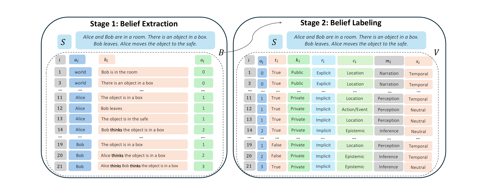
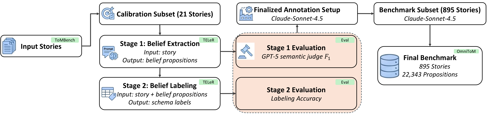

# OmniToM Official Release

OmniToM is a benchmark for evaluating Theory of Mind in language models through explicit belief-structure modeling. Instead of scoring only endpoint answers, OmniToM exposes the intermediate belief structure that a model must construct in order to reason coherently about what different actors know, believe, infer, intend, or misunderstand.

This release package contains the benchmark dataset, the prompt builders used by the public workflow, and a lightweight replication runner for Stage 1 belief extraction, Stage 2 belief labeling, semantic-judge evaluation, and metric aggregation.

This anonymous release supports replication of the public evaluation workflow reported in the paper only. It does not include the private benchmark-construction or calibration pipeline.



## Important Notice

OmniToM is intended for evaluation and analysis. To reduce benchmark contamination, we strongly recommend using the released stories for benchmarking rather than training.

## Benchmark at a Glance

- `895` benchmark stories
- `22,343` labeled belief propositions
- `156,401` total schema labels (`22,343 x 7`)
- `7` retained ToMBench source categories
- `21` additional calibration stories used during benchmark construction and judge validation, but not included in the released benchmark file

The retained benchmark categories are:

- Ambiguous Story Task
- False Belief Task
- Faux-pas Recognition Test
- Hinting Task Test
- Persuasion Story Task
- Scalar Implicature Test
- Strange Story Task

Category-level counts in the released benchmark:

| Category | Stories | Beliefs | Avg. beliefs/story |
| --- | ---: | ---: | ---: |
| Ambiguous Story Task | 98 | 4,614 | 47.08 |
| False Belief Task | 97 | 2,168 | 22.35 |
| Faux-pas Recognition Test | 142 | 3,981 | 28.04 |
| Hinting Task Test | 100 | 2,317 | 23.17 |
| Persuasion Story Task | 97 | 1,204 | 12.41 |
| Scalar Implicature Test | 154 | 3,251 | 21.11 |
| Strange Story Task | 207 | 4,808 | 23.23 |
| **Total** | **895** | **22,343** | **24.96** |

Belief-order distribution in the released benchmark:

- Order `0`: `32.57%`
- Order `1`: `57.12%`
- Order `2+`: `10.32%`

## Framework

OmniToM evaluates two linked tasks:

1. **Belief Extraction**
   Input a story and extract the relevant `(Actor, Belief, Order)` tuples.
2. **Belief Labeling**
   Input the story and the released benchmark belief table, then assign a seven-dimensional schema label vector to each belief. This reproduces the standalone Stage 2 evaluation reported in the paper, where Stage 1 and Stage 2 are evaluated independently.

The seven schema dimensions are:

- `Order`
- `Truth Status`
- `Knowledge Access`
- `Representation`
- `Content Type`
- `Mental Source`
- `Context`

## Construction and Statistics

The benchmark was built with a human-calibrated, LLM-assisted pipeline. Stories from seven retained ToMBench categories were split into a 21-story calibration subset and an 895-story benchmark subset. The calibration subset was used to validate the extraction, labeling, and semantic-judge setup before fixing the production annotation pipeline.



The released benchmark contains a broad distribution of schema labels across the seven dimensions.


## Included Files

- `benchmark_story_belief_labels.jsonl`
  Released benchmark dataset. One JSON object per story.
- `benchmark_prompting.py`
  Helpers for loading stories and reconstructing benchmark tables.
- `prompts_extract.py`
  Public Stage 1 extraction prompt builder.
- `prompts_label.py`
  Public Stage 2 labeling prompt builder.
- `prompt_evaluate.py`
  Semantic-judge prompt builder.
- `run_replication.py`
  Public end-to-end replication script.
- `HF_DATASET_CARD.md`
  Dataset card for dataset-hosting platforms.
- `THIRD_PARTY_NOTICES.md`
  Third-party attribution and license notice for ToMBench-derived story text.
- `LICENSE`
  License for the OmniToM release package.

## Dataset Format

Each line of `benchmark_story_belief_labels.jsonl` is one JSON object:

```json
{
  "story_id": 1,
  "story_category": "Ambiguous Story Task",
  "story": "Story text...",
  "beliefs": [
    {
      "actor": "world",
      "belief": "A minimal propositional statement.",
      "labels": {
        "order": "0",
        "truth_status": "True",
        "knowledge_access": "Public",
        "representation": "Explicit",
        "content_type": "Action/Event",
        "mental_source": "Narration",
        "context": "Neutral"
      }
    }
  ]
}
```

Key fields:

- `story_id`: unique integer identifier
- `story_category`: one of the seven retained categories
- `story`: raw story text
- `beliefs[].actor`: belief holder, with reserved actor `world` for narrated facts
- `beliefs[].belief`: minimal propositional belief statement
- `beliefs[].labels.*`: the seven schema labels for that belief

## Quick Usage

From this directory:

```python
from benchmark_prompting import load_story_record
from prompts_extract import build_extract_messages
from prompts_label import build_label_messages
from prompt_evaluate import build_evaluation_messages

record = load_story_record(1)
extract_system, extract_user = build_extract_messages(1)
label_system, label_user = build_label_messages(1)

predictions_csv = 'Actor,Belief\n"world","Example belief"'
judge_system, judge_user = build_evaluation_messages(1, predictions_csv)
```

## Public Replication Script

The simplest smoke test is:

```bash
python run_replication.py \
  --backend mock \
  --output-dir test_replication_run
```

The `mock` backend reuses the released benchmark annotations and should therefore produce perfect summary metrics (`1.000000`). This is a pipeline-integrity check rather than a benchmark result.

Running an open-source model locally:

```bash
python run_replication.py \
  --backend hf \
  --model meta-llama/Llama-3.1-8B-Instruct \
  --output-dir replication_llama31_8b
```

For larger open-weight models, the public Hugging Face backend now supports optional 4-bit loading to better match the paper’s runtime setup where quantization was required:

```bash
python run_replication.py \
  --backend hf \
  --model meta-llama/Llama-3.3-70B-Instruct \
  --load-in-4bit \
  --bnb-4bit-compute-dtype bf16 \
  --output-dir replication_llama33_70b_4bit
```

You can also assign different models to different stages:

```bash
python run_replication.py \
  --backend hf \
  --extract-model meta-llama/Llama-3.1-8B-Instruct \
  --label-model meta-llama/Llama-3.1-8B-Instruct \
  --judge-model meta-llama/Llama-3.1-8B-Instruct \
  --output-dir replication_custom
```

Useful options:

- `--story-ids 1,2,5-7`
- `--max-stories 25`
- `--stages extract label judge metrics`
- `--overwrite`
- `--no-story-context`
- `--judge-fewshots N`
- `--load-in-4bit`
- `--bnb-4bit-compute-dtype {bf16,fp16,fp32}`

## Dependencies

For the `mock` smoke test, Python `3.10+` and the standard library are sufficient.

For the Hugging Face backend, install:

- `torch`
- `transformers`
- `accelerate`

Optional for low-memory or quantized local loading:

- `bitsandbytes`

The public Hugging Face backend is intended as a lightweight open-source replication path. The paper’s larger open-weight evaluations used 4-bit quantization where required; in this release that behavior is available through `--load-in-4bit`, but environment setup remains the responsibility of the user.

If you want a single install file, use [`requirements.txt`](requirements.txt) in this directory.

## Output Layout

```text
<output-dir>/
  manifest.json
  extraction/
    raw/
    csv/
  labeling/
    raw/
    csv/
  judge/
    raw/
    csv/
  metrics/
    stage1_story_metrics.csv
    stage1_overall.csv
    stage1_by_category.csv
    stage2_story_metrics.csv
    stage2_overall.csv
    stage2_by_category.csv
```

## Metrics

- Stage 1 belief extraction:
  per-story precision, recall, and F1 from semantic-judge `MatchCount` outputs, plus macro averages overall and by category
- Stage 2 belief labeling:
  per-dimension accuracy, overall macro labeling accuracy, and macro averages overall and by category

## License and Attribution

The upstream ToMBench repository is distributed under the MIT License. OmniToM reuses ToMBench story text and adds new benchmark annotations, prompt builders, replication code, and documentation.

Third-party attribution details for the ToMBench-derived story text are provided in [`THIRD_PARTY_NOTICES.md`](THIRD_PARTY_NOTICES.md).

Unless otherwise noted, the files in this directory are distributed under the MIT License included in [`LICENSE`](LICENSE). This covers the OmniToM release package in this directory, including the released benchmark annotations and accompanying code artifacts.

Third-party model APIs and hosted inference services are not redistributed as part of this package. If you extend `run_replication.py` to such services, you are responsible for complying with the relevant provider terms.

## Citation

If you use OmniToM, please cite the paper:

```bibtex
@misc{omnitom2026,
  title={OmniToM: Benchmarking Theory of Mind in LLMs via Explicit Belief Modeling},
  author={Anonymous Authors},
  year={2026},
  note={Anonymous review release}
}
```

If you use the upstream source corpus, please also cite ToMBench:

```bibtex
@misc{chen2024tombench,
  title={ToMBench: Benchmarking Theory of Mind in Large Language Models},
  author={Zhuang Chen and Jincenzi Wu and Jinfeng Zhou and Bosi Wen and Guanqun Bi and Gongyao Jiang and Yaru Cao and Mengting Hu and Yunghwei Lai and Zexuan Xiong and Minlie Huang},
  year={2024},
  eprint={2402.15052},
  archivePrefix={arXiv},
  primaryClass={cs.CL}
}
```
